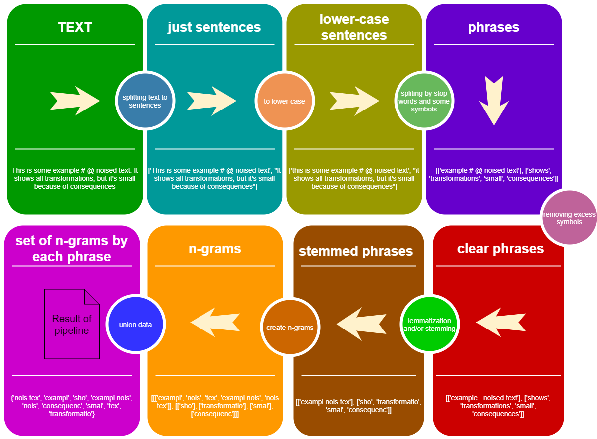

[](https://pypi.org/project/StemLemPipe/)
[](https://github.com/PasaOpasen/Stem-Lem-Pipeline/issues) 
[](https://github.com/PasaOpasen/Stem-Lem-Pipeline/pulls)

[](https://pepy.tech/project/StemLemPipe)
[](https://pepy.tech/project/StemLemPipe)
[](https://pepy.tech/project/StemLemPipe)

# Stemmer-lemmatizer pipeline

Russian-based (but not only) text transformer used several stemming and lemmatization backends and text preparation features

```
pip install StemLemPipe
```

- [Stemmer-lemmatizer pipeline](#stemmer-lemmatizer-pipeline)
  - [The purpose of this package](#the-purpose-of-this-package)
  - [Small example](#small-example)
  - [Big example](#big-example)
  - [Steps description](#steps-description)
    - [Splitting text to sentences](#splitting-text-to-sentences)
    - [Text preparations like removing some symbols and setting lower case](#text-preparations-like-removing-some-symbols-and-setting-lower-case)
    - [Splitting each sentence by some symbols and stop words](#splitting-each-sentence-by-some-symbols-and-stop-words)
    - [Lemmatization and/or stemming](#lemmatization-andor-stemming)
    - [N-grams](#n-grams)
    - [Union to set](#union-to-set)
  - [Pipeline](#pipeline)
  - [Another tools](#another-tools)
    - [Metrics](#metrics)
    - [Little functions](#little-functions)


## The purpose of this package

The main purpose of `StemLemPipe` is the conversion texts to python sets of useful strings which are 1-, 2-, 3-, ..., n-grams of lemmatized and/or stemmed words of these texts splitted by:
* sentences
* parts of sentences
* stop words

Have a look to the concept of `StemLemPipe` pipeline:



## Small example
```python
from StemLemPipe import phrases2lower, phrases_without_excess_symbols, phrases_transform, text2sentences, split_by_words, sentence_split, create_stemmer_lemmer, words_to_ngrams_list, sum_phrases, wordlist2set, stopwords, StemLemPipeline


text_example = """Lemmatization is the process of grouping together the different inflected forms of a word so they can be analysed as a single item. Lemmatization is similar to stemming but it brings context to the words. So it links words with similar meaning to one word."""

#text_example = "This is some example # @ noised text. It shows all transformations, but it's small because of consequences"

def print2(obj):
    print(obj)
    print()


# create stemmer-lemmatizer pipeline function
stem_lem = create_stemmer_lemmer(lemmatizer_backend='wordnet', stemmer_backend='snowball', language = 'en')


# convert all text to list of sentences
sentences = text2sentences(text_example)
print2(sentences)

# ['Lemmatization is the process of grouping together the different inflected forms of a word so they can be analysed as a single item', 'Lemmatization is similar to stemming but it brings context to the words', 'So it links words with similar meaning to one word']


# transform each phrase to lower case
clean_sentences = phrases2lower(sentences)
print2(clean_sentences)
# ['lemmatization is the process of grouping together the different inflected forms of a word so they can be analysed as a single item', 'lemmatization is similar to stemming but it brings context to the words', 'so it links words with similar meaning to one word']

# split each sentence to list of phrases between separators and stop words
phrases = [sentence_split(sentence , separators=',;', stop_words = stopwords('en')) for sentence in clean_sentences]
print2(phrases)
# [['lemmatization', 'process', 'grouping together', 'different inflected forms', 'word', 'can', 'analysed', 'single item'], ['lemmatization', 'similar', 'stemming', 'brings context', 'words'], ['links words', 'similar meaning', 'one word']]


# remove excess symbols from phrases
char_phrases = phrases_without_excess_symbols(phrases, include_alpha= True, include_numbers= True)
print2(char_phrases)
# [['lemmatization', 'process', 'grouping together', 'different inflected forms', 'word', 'can', 'analysed', 'single item'], ['lemmatization', 'similar', 'stemming', 'brings context', 'words'], ['links words', 'similar meaning', 'one word']]

# stem and lemmatize all words in all phrases
stemmed_phrases = phrases_transform(char_phrases, func = stem_lem)
print2(stemmed_phrases)
# [['lemmatizatio', 'proce', 'group togeth', 'differ inflect form', 'wor', 'ca', 'analys', 'singl ite'], ['lemmatizatio', 'simila', 'stemmin', 'bring contex', 'wor'], ['link word', 'similar meanin', 'one wor']]

# convert each phrase to list of n-grams
n_grams = phrases_transform(stemmed_phrases, func = lambda w: words_to_ngrams_list(w.split(), n_min = 1, n_max = 2))
print2(n_grams)
# [[['lemmatizatio'], ['proce'], ['group', 'togeth', 'group togeth'], ['differ', 'inflect', 'form', 'differ inflect', 'inflect form'], ['wor'], ['ca'], ['analys'], ['singl', 'ite', 'singl ite']], [['lemmatizatio'], ['simila'], ['stemmin'], ['bring', 'contex', 'bring contex'], ['wor']], [['link', 'word', 'link word'], ['similar', 'meanin', 'similar meanin'], ['one', 'wor', 'one wor']]]

# convert list of list of list to just list
total = sum_phrases(n_grams)
print2(total)
# ['lemmatizatio', 'proce', 'group', 'togeth', 'group togeth', 'differ', 'inflect', 'form', 'differ inflect', 'inflect form', 'wor', 'ca', 'analys', 'singl', 'ite', 'singl ite', 'lemmatizatio', 'simila', 'stemmin', 'bring', 'contex', 'bring contex', 'wor', 'link', 'word', 'link word', 'similar', 'meanin', 'similar meanin', 'one', 'wor', 'one wor']

# convert all objects to set
total_set = wordlist2set(total, save_order=False)
print2(total_set)
# {'wor', 'ite singl', 'group', 'stemmin', 'meanin similar', 'form inflect', 'differ inflect', 'lemmatizatio', 'analys', 'one', 'ite', 'group togeth', 'ca', 'word', 'meanin', 'singl', 'inflect', 'similar', 'form', 'bring', 'contex', 'link', 'bring contex', 'link word', 'togeth', 'one wor', 'differ', 'proce', 'simila'}


# all these steps are equal to pipeline

pipe = StemLemPipeline([

    text2sentences,phrases2lower,
    lambda sentences: list(map(lambda s: sentence_split(s , separators=',;', stop_words = stopwords('en')), sentences)),
    
    lambda p: phrases_without_excess_symbols(p, include_alpha= True, include_numbers= True),
    lambda p: phrases_transform(p, stem_lem),
    lambda p: phrases_transform(p, func = lambda w: words_to_ngrams_list(w.split(), n_min = 1, n_max = 2)),
    sum_phrases,
    lambda p: wordlist2set(p, save_order=False)
])

pipe(text_example)
# {'wor', 'ite singl', 'group', 'stemmin', 'meanin similar', 'form inflect', 'differ inflect', 'lemmatizatio', 'analys', 'one', 'ite', 'group togeth', 'ca', 'word', 'meanin', 'singl', 'inflect', 'similar', 'form', 'bring', 'contex', 'link', 'bring contex', 'link word', 'togeth', 'one wor', 'differ', 'proce', 'simila'}

print(total_set == pipe(text_example)) # true
```

## Big example

```python
from StemLemPipe import phrases2lower, phrases_without_excess_symbols, phrases_transform, text2sentences, split_by_words, sentence_split, create_stemmer_lemmer, words_to_ngrams_list, sum_phrases, wordlist2set, stopwords, StemLemPipeline


text_example = """Если в жопе шило, я могу достать.
Я имею опыт, лучше "да" сказать.
Влагалище твое в тонус приведу.
Пиши адрес, я приду.

Мой член, словно банан, кривой
И в матку вплоть до дна зайдет,
И полчаса стоять смогет,
Как на границе часовой.

Ты будешь просто разрываться,
Когда начнем с тобой ебаться,
И в счастье будешь же казниться,
Что раньше не решилась соблазниться.

Я медленно сниму штаны с тебя,
И поцелуями сломлю твое сомненье,
От похоти войдешь ты в опьяненье,
Пока не кончишь от меня.

Я смазку принесу с собой,
Сначала ты почувствуешь прохладу,
Но буду жарить я своей большой трубой,
Пока не получу усладу.

Ты напиши, и я приду,
Если не буду очень занят,
Пощекочу твою пизду
Снутри и долго, ибо не устанет.

Я покусаю твою попу
И буду долго трахать в жопу,
Пока ментов не вызовут на вой
Той девки, что кайфует подо мной.

Потом сниму презерватив,
Мирамистином всё полью,
Минут пятнадцать перерыв —
И снова я на час в бою.

И шея будет вся в укусах и засосах,
И будет всё болеть, включая твою грудь,
Но через пару дней, тоскуя без вопросов,
Захочешь эту ночь вернуть."""

def print2(obj):
    print(obj)
    print()


# create stemmer-lemmatizer pipeline function
stem_lem = create_stemmer_lemmer(lemmatizer_backend='pymorphy', stemmer_backend='snowball')

# convert all text to list of sentences
sentences = text2sentences(text_example)
print2(sentences)
# ['Если в жопе шило, я могу достать', 'Я имею опыт, лучше "да" сказать', 'Влагалище твое в тонус приведу', 'Пиши адрес, я приду', 'Мой член, словно банан, кривой И в матку вплоть до дна зайдет, И полчаса стоять смогет, Как на границе часовой', 'Ты будешь просто разрываться, Когда начнем с тобой ебаться, И в счастье будешь же казниться, Что раньше не решилась соблазниться', 'Я медленно сниму штаны с тебя, И поцелуями сломлю твое сомненье, От похоти войдешь ты в опьяненье, Пока не кончишь от меня', 'Я смазку принесу с собой, Сначала ты почувствуешь прохладу, Но буду жарить я своей большой трубой, Пока не получу усладу', 'Ты напиши, и я приду, Если не буду очень занят, Пощекочу твою пизду Снутри и долго, ибо не устанет', 'Я покусаю твою попу И буду долго трахать в жопу, Пока ментов не вызовут на вой Той девки, что кайфует подо мной', 'Потом сниму презерватив, Мирамистином всё полью, Минут пятнадцать перерыв — И снова я на час в бою', 'И шея будет вся в укусах и засосах, И будет всё болеть, включая твою грудь, Но через пару дней, тоскуя без вопросов, Захочешь эту ночь вернуть']

# transform each phrase to lower case
clean_sentences = phrases2lower(sentences)
print2(clean_sentences)
# ['если в жопе шило, я могу достать', 'я имею опыт, лучше "да" сказать', 'влагалище твое в тонус приведу', 'пиши адрес, я приду', 'мой член, словно банан, кривой и в матку вплоть до дна зайдет, и полчаса стоять смогет, как на границе часовой', 'ты будешь просто разрываться, когда начнем с тобой ебаться, и в счастье будешь же казниться, что раньше не решилась соблазниться', 'я медленно сниму штаны с тебя, и поцелуями сломлю твое сомненье, от похоти войдешь ты в опьяненье, пока не кончишь от меня', 'я смазку принесу с собой, сначала ты почувствуешь прохладу, но буду жарить я своей большой трубой, пока не получу усладу', 'ты напиши, и я приду, если не буду очень занят, пощекочу твою пизду снутри и долго, ибо не устанет', 'я покусаю твою попу и буду долго трахать в жопу, пока ментов не вызовут на вой той девки, что кайфует подо мной', 'потом сниму презерватив, мирамистином всё полью, минут пятнадцать перерыв — и снова я на час в бою', 'и шея будет вся в укусах и засосах, и будет всё болеть, включая твою грудь, но через пару дней, тоскуя без вопросов, захочешь эту ночь вернуть']

# split each sentence to list of phrases between separators and stop words
phrases = [sentence_split(sentence , separators=',;', stop_words = stopwords('ru')) for sentence in clean_sentences]
print2(phrases)
# [['жопе шило', 'могу достать'], ['имею опыт', '"да"'], ['влагалище твое', 'тонус приведу'], ['пиши адрес', 'приду'], ['член', 'словно банан', 'кривой', 'матку вплоть', 'дна зайдет', 'полчаса стоять смогет', 'границе часовой'], ['разрываться', 'начнем', 'ебаться', 'счастье', 'казниться', 'решилась соблазниться'], ['медленно сниму штаны', 'поцелуями сломлю твое сомненье', 'похоти войдешь', 'опьяненье', 'кончишь'], ['смазку принесу', 'почувствуешь прохладу', 'жарить', 'большой трубой', 'получу усладу'], ['напиши', 'приду', 'пощекочу твою пизду снутри', 'ибо', 'устанет'], ['покусаю твою попу', 'трахать', 'жопу', 'ментов', 'вызовут', 'вой той девки', 'кайфует подо'], ['сниму презерватив', 'мирамистином', 'полью', 'минут', 'перерыв —', 'час', 'бою'], ['шея', 'укусах', 'засосах', 'болеть', 'включая твою грудь', 'пару дней', 'тоскуя', 'вопросов', 'захочешь', 'ночь вернуть']]

# remove excess symbols from phrases
char_phrases = phrases_without_excess_symbols(phrases, include_alpha= True, include_numbers= True)
print2(char_phrases)
# [['жопе шило', 'могу достать'], ['имею опыт', 'да'], ['влагалище твое', 'тонус приведу'], ['пиши адрес', 'приду'], ['член', 'словно банан', 'кривой', 'матку вплоть', 'дна зайдет', 'полчаса стоять смогет', 'границе часовой'], ['разрываться', 'начнем', 'ебаться', 'счастье', 'казниться', 'решилась соблазниться'], ['медленно сниму штаны', 'поцелуями сломлю твое сомненье', 'похоти войдешь', 'опьяненье', 'кончишь'], ['смазку принесу', 'почувствуешь прохладу', 'жарить', 'большой трубой', 'получу усладу'], ['напиши', 'приду', 'пощекочу твою пизду снутри', 'ибо', 'устанет'], ['покусаю твою попу', 'трахать', 'жопу', 'ментов', 'вызовут', 'вой той девки', 'кайфует подо'], ['сниму презерватив', 'мирамистином', 'полью', 'минут', 'перерыв ', 'час', 'бою'], ['шея', 'укусах', 'засосах', 'болеть', 'включая твою грудь', 'пару дней', 'тоскуя', 'вопросов', 'захочешь', 'ночь вернуть']]

# stem and lemmatize all words in all phrases
stemmed_phrases = phrases_transform(char_phrases, func = stem_lem)
print2(stemmed_phrases)
# [['жоп шил', 'моч доста'], ['имет оп', 'да'], ['влагалищ тво', 'тонус привест'], ['писа адрес', 'прийт'], ['член', 'словн бана', 'крив', 'матк вплот', 'дно зайт', 'полчас стоя смогет', 'границ часов'], ['разрыва', 'нача', 'еба', 'счаст', 'казн', 'реш соблазн'], ['медлен снят штан', 'поцел слом тво сомнен', 'похот войт', 'опьянен', 'конч'], ['смазк принест', 'почувствова прохлад', 'жар', 'больш труб', 'получ услад'], ['написа', 'прийт', 'пощекота тво пизд снутерет', 'иб', 'уста'], ['покуса тво поп', 'траха', 'жоп', 'мент', 'вызва', 'во тот девк', 'кайфова под'], ['снят презерват', 'мирамистин', 'пол', 'минут', 'перер', 'час', 'бо'], ['ше', 'укус', 'засос', 'болет', 'включ тво груд', 'пар ден', 'тоскова', 'вопрос', 'захотет', 'ноч вернут']]

# convert each phrase to list of n-grams
n_grams = phrases_transform(stemmed_phrases, func = lambda w: words_to_ngrams_list(w.split(), n_min = 1, n_max = 2))
print2(n_grams)
# [[['жоп', 'шил', 'жоп шил'], ['моч', 'доста', 'моч доста']], [['имет', 'оп', 'имет оп'], ['да']], [['влагалищ', 'тво', 'влагалищ тво'], ['тонус', 'привест', 'тонус привест']], [['писа', 'адрес', 'писа адрес'], ['прийт']], [['член'], ['словн', 'бана', 'словн бана'], ['крив'], ['матк', 'вплот', 'матк вплот'], ['дно', 'зайт', 'дно зайт'], ['полчас', 'стоя', 'смогет', 'полчас стоя', 'стоя смогет'], ['границ', 'часов', 'границ часов']], [['разрыва'], ['нача'], ['еба'], ['счаст'], ['казн'], ['реш', 'соблазн', 'реш соблазн']], [['медлен', 'снят', 'штан', 'медлен снят', 'снят штан'], ['поцел', 'слом', 'тво', 'сомнен', 'поцел слом', 'слом тво', 'тво сомнен'], ['похот', 'войт', 'похот войт'], ['опьянен'], ['конч']], [['смазк', 'принест', 'смазк принест'], ['почувствова', 'прохлад', 'почувствова прохлад'], ['жар'], ['больш', 'труб', 'больш труб'], ['получ', 'услад', 'получ услад']], [['написа'], ['прийт'], ['пощекота', 'тво', 'пизд', 'снутерет', 'пощекота тво', 'тво пизд', 'пизд снутерет'], ['иб'], ['уста']], [['покуса', 'тво', 'поп', 'покуса тво', 'тво поп'], ['траха'], ['жоп'], ['мент'], ['вызва'], ['во', 'тот', 'девк', 'во тот', 'тот девк'], ['кайфова', 'под', 'кайфова под']], [['снят', 'презерват', 'снят презерват'], ['мирамистин'], ['пол'], ['минут'], ['перер'], ['час'], ['бо']], [['ше'], ['укус'], ['засос'], ['болет'], ['включ', 'тво', 'груд', 'включ тво', 'тво груд'], ['пар', 'ден', 'пар ден'], ['тоскова'], ['вопрос'], ['захотет'], ['ноч', 'вернут', 'ноч вернут']]]

# convert list of list of list to just list
total = sum_phrases(n_grams)
print2(total)
# ['жоп', 'шил', 'жоп шил', 'моч', 'доста', 'моч доста', 'имет', 'оп', 'имет оп', 'да', 'влагалищ', 'тво', 'влагалищ тво', 'тонус', 'привест', 'тонус привест', 'писа', 'адрес', 'писа адрес', 'прийт', 'член', 'словн', 'бана', 'словн бана', 'крив', 'матк', 'вплот', 'матк вплот', 'дно', 'зайт', 'дно зайт', 'полчас', 'стоя', 'смогет', 'полчас стоя', 'стоя смогет', 'границ', 'часов', 'границ часов', 'разрыва', 'нача', 'еба', 'счаст', 'казн', 'реш', 'соблазн', 'реш соблазн', 'медлен', 'снят', 'штан', 'медлен снят', 'снят штан', 'поцел', 'слом', 'тво', 'сомнен', 'поцел слом', 'слом тво', 'тво сомнен', 'похот', 'войт', 'похот войт', 'опьянен', 'конч', 'смазк', 'принест', 'смазк принест', 'почувствова', 'прохлад', 'почувствова прохлад', 'жар', 'больш', 'труб', 'больш труб', 'получ', 'услад', 'получ услад', 'написа', 'прийт', 'пощекота', 'тво', 'пизд', 'снутерет', 'пощекота тво', 'тво пизд', 'пизд снутерет', 'иб', 'уста', 'покуса', 'тво', 'поп', 'покуса тво', 'тво поп', 'траха', 'жоп', 'мент', 'вызва', 'во', 'тот', 'девк', 'во тот', 'тот девк', 'кайфова', 'под', 'кайфова под', 'снят', 'презерват', 'снят презерват', 'мирамистин', 'пол', 'минут', 'перер', 'час', 'бо', 'ше', 'укус', 'засос', 'болет', 'включ', 'тво', 'груд', 'включ тво', 'тво груд', 'пар', 'ден', 'пар ден', 'тоскова', 'вопрос', 'захотет', 'ноч', 'вернут', 'ноч вернут']

# convert all objects to set
total_set = wordlist2set(total, save_order=False)
print2(total_set)
# {'траха', 'влагалищ', 'больш труб', 'адрес', 'зайт', 'влагалищ тво', 'снят штан', 'вопрос', 'счаст', 'слом', 'груд тво', 'поцел слом', 'дно', 'опьянен', 'жоп', 'иб', 'труб', 'болет', 'тот', 'мирамистин', 'моч', 'поцел', 'доста моч', 'прохлад', 'мент', 'пощекота тво', 'укус', 'ден', 'кайфова', 'уста', 'войт похот', 'да', 'девк тот', 'во тот', 'вернут ноч', 'груд', 'границ часов', 'услад', 'засос', 'имет оп', 'презерват', 'стоя', 'принест', 'сомнен тво', 'пизд тво', 'покуса тво', 'разрыва', 'перер', 'оп', 'сомнен', 'соблазн', 'еба', 'крив', 'тонус', 'полчас стоя', 'жар', 'захотет', 'тоскова', 'смогет', 'вплот', 'писа', 'бо', 'пощекота', 'адрес писа', 'почувствова прохлад', 'медлен', 'снят', 'вызва', 'кайфова под', 'ноч', 'получ услад', 'во', 'прийт', 'пар', 'член', 'минут', 'похот', 'медлен снят', 'казн', 'написа', 'штан', 'включ тво', 'реш', 'войт', 'снутерет', 'покуса', 'ше', 'пол', 'девк', 'смогет стоя', 'час', 'пизд снутерет', 'конч', 'почувствова', 'жоп шил', 'доста', 'ден пар', 'включ', 'часов', 'привест тонус', 'слом тво', 'дно зайт', 'пизд', 'смазк', 'вернут', 'словн', 'больш', 'презерват снят', 'бана словн', 'имет', 'тво', 'вплот матк', 'принест смазк', 'шил', 'полчас', 'поп тво', 'под', 'поп', 'бана', 'матк', 'нача', 'реш соблазн', 'границ', 'получ', 'привест'}


# all these steps are equal to pipeline

pipe = StemLemPipeline([

    text2sentences,phrases2lower,
    lambda sentences: list(map(lambda s: sentence_split(s , separators=',;', stop_words = stopwords('ru')), sentences)),
    
    lambda p: phrases_without_excess_symbols(p, include_alpha= True, include_numbers= True),
    lambda p: phrases_transform(p, stem_lem),
    lambda p: phrases_transform(p, func = lambda w: words_to_ngrams_list(w.split(), n_min = 1, n_max = 2)),
    sum_phrases,
    lambda p: wordlist2set(p, save_order=False)
])

pipe(text_example)


print(total_set == pipe(text_example)) # True
```

## Steps description

Is it so needed to make many splits, lemmatization and stemming?.. Why we cannot use just regular expressions? I think we always should do more to **remove unnecessary information and engineer better information** from text data. For example:
* It's obvious that words *'see'* and *'saw'* are same words. We ought to use lemmatization to save this relations for ML model.
* For some words it will be better to use stemming: *'dog'*, *'dogs'*, *'dog\`s'*, *'dogs\`'* are same words. It's better to have 1 word instead of 4
* Simplest way to save relations between words is using n-grams but it's not good to make so many 2-grams and 3-grams because of [curse of dimensionality](https://en.wikipedia.org/wiki/Curse_of_dimensionality); so, **we shouldn't make n-grams which have no sense**! But how to prevent it? I think next rules are right almost always:
  * In text like *'I think it is good idea. Let me know'* there is no sense of creating n-grams *'idea let'* or *'idea let me'* because the probability of importance between last words in sentence and first words in next sentence is small. So we should split text by sentences and create n-grams for each sentence, not for all text
  * There is same idea for words beside stop words or symbols like `, ; ? !`. And we should split sentences by these objects too before creating n-grams

Beneath there are some instructions how to do these logic using `StemLemPipe`

### Splitting text to sentences

There are several functions for splitting text to list of strings using different logic:
* `text2sentences(txt, equal_to_space = ["\n"])`
* `split_by_words(sentence, words)`
* `sentence_split(sentence, separators = ",;!?", stop_words = None)`

See [example of using](tests/splitting_text.py)

Use `text2sectences` to split text to list of sentences.


### Text preparations like removing some symbols and setting lower case

After previous preparations we have list of sentences where each sentence is string or list of string. To apply some functions to strings in this construction there is `phrases_transform(phrases, func, progress_bar = False)` function where `func` is the function applying to each string. Also there are some wrappers of `phrases_transform` for certain tasks:
* `phrases2lower(phrases)`
* `phrases_without_excess_symbols(phrases, include_alpha = True, include_numbers = False, include_also = None)`

See [example of using](tests/phrases_prep.py)

### Splitting each sentence by some symbols and stop words

For this u can use `sentence_split` or `split_by_words` functions from [previous block](#splitting-text-to-sentences).

Use `stopwords(language = 'ru')` function to get stop words, but u can use your own stop words too!

### Lemmatization and/or stemming

To apply lemmatization of stemming for phrases u should create some lemmatization function and use if with `phrases_transform`. Create lemmatization function by one of ways:
* `create_lemmatizer(backend = 'pymorphy', language = 'ru')`
* `create_stemmer(backend = 'snowball', language = 'ru')`
* `create_stemmer_lemmer(lemmatizer_backend = 'pymorphy', stemmer_backend = 'snowball', language = 'ru')` -- pipeline with lemmatizer and stemmer
* create any another wrapper for function `text -> text`

**Available stemmers**:

| language        | backend           |
| ------------- |:-------------:| 
| `'ru'`      | `'snowball'` |
| `'en'`      | `'snowball'`      |

**Available lemmatizers**:

| language        | backend           |
| ------------- |:-------------:| 
| `'ru'`      | `'pymorphy'`, `'mystem'` |
| `'en'`      | `'wordnet'`      |

It's not hard to add new lemmatizers but just let me know. Also have a look at [source file](StemLemPipe/stemlem_operators.py)

### N-grams

Methods for getting n-grams *from array of words*:
* `get_ngrams(arr, n=2)`
* `words_to_ngrams_list(words, n_min = 1, n_max = 2)`

How to use:
```python
from StemLemPipe import get_ngrams, words_to_ngrams_list

text = "word1 word2 word3 ... word10"

# returns generator
gen = get_ngrams(text.split(), n = 3)
# just list of lists
print(list(gen))
# [['word1', 'word2', 'word3'], ['word2', 'word3', '...'], ['word3', '...', 'word10']]


# words in n-gram are combined, it's list of strings
print(words_to_ngrams_list(text.split(), n_min = 1, n_max = 3))
# ['word1', 'word2', 'word3', '...', 'word10', 'word1 word2', 'word2 word3', 'word3 ...', '... word10', 'word1 word2 word3', 'word2 word3 ...', 'word3 ... word10']
```

### Union to set

We can convert those lists of lists of lists... to list of strings using `sum_phrases` function. Also we can convert these list of strings to set using `wordlist2set(input_list, save_order = False)` function there `save_order = True` means that n-grams like `word1 word2` and `word2 word1` are not some (same otherwise).

## Pipeline

Create `StemLemPipeline` object for using certain functions one after the other for new texts.

Create pipeline using code:
```python
from StemLemPipe import StemLemPipeline

pipe = StemLemPipeline([func1, func2, ...])
```

For using pipeline just call:
```python
result = pipe('some text for preparations')
```


## Another tools

### Metrics

It supports next metrics:
* `Levenstein.usual(str1, str2)`
* `Levenstein.deep(s1, s2, remove_desc = True)`


### Little functions

For text preparation it can be highly useful to use next functions:
* `remove_words(text, words)` -- just removes next words from text without splitting to phrases (unlike `sentence_split`)
* `remove_hook_words(text, hook_words)` --  removes hook words from text with one next word. For `text = "a b c d e f"` and `hook_words = ['b', 'e']` returns `"a d"` (without b, e and next words) ([example](/tests/hook_words.py))
